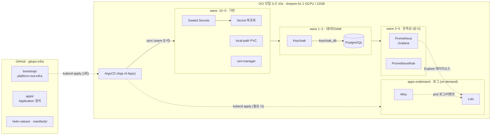

# gitops-infra

[](https://github.com/yhsk9200/gitops-infra/actions/workflows/validate.yaml)

OCI Always Free 단일 노드(Ampere A1, 2 OCPU / 12GB) k3s 위에 플랫폼 공용 인프라 — IAM(Keycloak), 관측성(Prometheus/Grafana, 로그 Loki/Alloy는 on-demand), 데이터베이스(PostgreSQL), 시크릿(Sealed Secrets) — 를 **ArgoCD App of Apps 패턴**으로 선언적으로 배포·운영하는 개인 GitOps 레포입니다.

목표는 "많은 컴포넌트를 띄우는 것"이 아니라, **제약(무료 티어, 단일 노드, 단독 운영) 아래에서 무엇을 채택하고 무엇을 버렸는지**를 코드와 문서로 남기는 것입니다.

## 1. 이 레포가 보여주는 것

- **App of Apps + sync wave 의존성 설계** — 시크릿 컨트롤러 → 시크릿 → 스토리지 → DB → IAM → 관측성 순서를 wave로 강제
- **시크릿까지 GitOps** — 평문 시크릿 없이 SealedSecret만 커밋, 클러스터 교체 시 reseal 절차 문서화
- **트레이드오프 의사결정 기록(ADR)** — 단일 노드 채택, 공용 Redis 제거 등 "왜"를 남김
- **운영 런북** — 클러스터 재구축, 백업/복구, 클러스터 접근을 재현 가능한 절차로 문서화
- **CI 검증 게이트** — push 전에 kubeconform + `helm template` 렌더링으로 매니페스트/values 검증

## 2. 핵심 의사결정 (ADR)

| 결정 | 트레이드오프 요약 | 문서 |
| --- | --- | --- |
| **단일 노드 토폴로지** | 2노드는 etcd 쿼럼이 없어 HA가 아니고, local-path PV는 노드에 고정되어 stateful 복원력이 0 — 분절된 노드보다 통합된 단일 노드가 낫다 | [ADR-0002](docs/adr/0002-single-node-cluster-topology.md) |
| **12GB 리핏 (free-tier 반감 대응)** | Always Free가 4 OCPU/24GB→2 OCPU/12GB로 축소 — capability를 영구 삭제하지 않고 lean 상시(메트릭)+on-demand(로그/Trivy)로 right-sizing | [ADR-0004](docs/adr/0004-refit-platform-for-12gb-free-tier.md) |
| **공용 Redis 제거** | 유일한 후보 소비자(Harbor)가 chart의 `lookup` 기반 `existingSecret` 제약으로 ArgoCD 렌더링과 비호환 — 빈 공용 컴포넌트를 유지하는 대신 제거 | [ADR-0003](docs/adr/0003-remove-shared-redis.md) |
| **Harbor 제거 — 레지스트리 오프클러스터화** | 공식 이미지가 amd64 전용이라 Ampere(arm64) 노드에서 기동 불가 + 실수요(GHCR로 충분) 대비 최중량 컴포넌트 — 유지 대신 제거, self-hosted 필요 시 arm64 네이티브(zot) on-demand 재검토 | [ADR-0006](docs/adr/0006-remove-harbor-registry-off-cluster.md) |
| **AI 시뮬레이터 플랫폼 방향** | MLflow + MinIO 조합, 이 레포가 아닌 별도 GitOps 단위로 분리 — Kubeflow는 요구가 명확해질 때까지 보류 | [ADR-0001](docs/adr/0001-ai-model-simulator-platform.md) |

ADR 외에 values 주석으로 남긴 결정들:

- **Prometheus 경량화(retention 5d/limit 1Gi)** — 12GB 리핏의 메모리 우선순위화 (`helm-values/monitoring/kube-prometheus-stack-values.yaml`, [ADR-0004](docs/adr/0004-refit-platform-for-12gb-free-tier.md))
- **Alloy를 DaemonSet이 아닌 단일 Deployment**로 운영 — hostPath/privileged 회피의 대가로 복원력 일부 양보 (`helm-values/monitoring/alloy-values.yaml`)
- **Loki single-binary + 캐시/카나리 제거** — 단일 노드 자원에 맞춘 최소 구성. 로그 스택은 on-demand(`apps-ondemand/`) (`helm-values/monitoring/loki-values.yaml`)
- **백업은 수동 반출** — 자동화 전에 절차 이해와 리허설 우선 (`docs/platform-backup-restore-runbook.md`)
- **Bitnami 카탈로그 개편 대응** — 차트는 OCI 레지스트리, 이미지는 `bitnamilegacy` 고정 태그로 핀 (`helm-values/database/postgres-values.yaml`)

## 3. 아키텍처



## 4. 배포 구조

최초 부트스트랩은 `bootstrap/platform-root-infra.yaml`을 수동 적용합니다. 이후 Root Application이 `apps/` 디렉토리의 자식 Application을 동기화합니다.

```text
platform-root-infra
└── apps/                          ← root가 자동 동기화 (상시)
    ├── appproject-platform-infra
    ├── platform-infra-namespaces
    ├── platform-system-sealed-secrets
    ├── platform-infra-secrets
    ├── platform-infra-storage
    ├── platform-system-cert-manager
    ├── platform-db-postgres
    ├── platform-iam-keycloak
    ├── platform-monitoring-prometheus
    └── platform-monitoring-rules

apps-ondemand/                     ← root 스캔 제외, 필요 시 kubectl apply (ADR-0004)
    ├── platform-monitoring-loki
    └── platform-monitoring-alloy
```

### Sync Wave

| Wave | Application | 역할 |
| --- | --- | --- |
| `-10` | `appproject-platform-infra` | ArgoCD AppProject |
| `-3` | `platform-infra-namespaces` | 공용 네임스페이스 생성 |
| `-2` | `platform-system-sealed-secrets` | Sealed Secrets controller |
| `-1` | `platform-infra-secrets` | SealedSecret 리소스 |
| `0` | `platform-infra-storage`, `platform-system-cert-manager` | 기본 스토리지와 cert-manager |
| `1` | `platform-db-postgres` | 공용 데이터베이스 |
| `2` | `platform-iam-keycloak` | 인증/인가 |
| `3` | `platform-monitoring-prometheus` | Prometheus, Grafana, Alertmanager |
| `5` | `platform-monitoring-rules` | 알림 룰 |

> 로그 스택(`platform-monitoring-loki`, `platform-monitoring-alloy`)은 `apps-ondemand/`로 분리된 **on-demand** 컴포넌트입니다. root가 자동 배포하지 않으며, 필요할 때 `kubectl apply -f apps-ondemand/`로 띄웁니다 ([ADR-0004](docs/adr/0004-refit-platform-for-12gb-free-tier.md)).

### 네임스페이스

| Namespace | 용도 |
| --- | --- |
| `platform-system` | Sealed Secrets |
| `platform-db` | PostgreSQL |
| `platform-iam` | Keycloak |
| `platform-monitoring` | Prometheus, Grafana (Loki/Alloy는 on-demand) |
| `cert-manager` | cert-manager controller |

## 5. 디렉토리 구조

```text
gitops-infra/
├── .github/workflows/
│   └── validate.yaml          ← CI: kubeconform + helm template 렌더링 검증
├── bootstrap/
│   └── platform-root-infra.yaml
├── apps/                      ← ArgoCD Application 정의 (root 자동 동기화, 상시)
├── apps-ondemand/             ← on-demand Application (Loki/Alloy, ADR-0004)
├── manifests/
│   ├── namespaces/
│   ├── security/              ← SealedSecret (reseal 명령 주석 포함)
│   ├── storage/
│   └── monitoring/rules/      ← PrometheusRule
├── helm-values/
│   ├── database/
│   ├── iam/
│   ├── monitoring/
│   └── system/
└── docs/
    ├── adr/                   ← 의사결정 기록 (0001~0006)
    ├── cluster-rebuild-runbook.md
    ├── platform-backup-restore-runbook.md
    └── ...
```

## 6. 최초 부트스트랩

클러스터에 SealedSecret을 재암호화한 뒤 Root Application을 적용합니다. 전체 절차는 `docs/cluster-rebuild-runbook.md`를 따릅니다.

```bash
kubectl apply -f bootstrap/platform-root-infra.yaml
```

ArgoCD는 이후 `apps/` 아래 Application을 sync wave 순서대로 배포합니다.

## 7. SealedSecret 재암호화

이 저장소의 SealedSecret은 대상 클러스터의 Sealed Secrets 공개키로 다시 암호화해야 합니다.

```bash
kubeseal --fetch-cert \
  --controller-name=sealed-secrets-controller \
  --controller-namespace=platform-system \
  > pub-cert.pem
```

주요 Secret:

| Secret | Namespace | 주요 key | 비고 |
| --- | --- | --- | --- |
| `postgres-db-secret` | `platform-db` | `postgres-password`, `keycloak-password` | PostgreSQL superuser와 앱 DB 계정 |
| `keycloak-admin-secret` | `platform-iam` | `admin-password` | Keycloak 관리자 |
| `keycloak-db-secret` | `platform-iam` | `keycloak-password` | `postgres-db-secret`의 `keycloak-password`와 동일 값 |
| `grafana-admin-secret` | `platform-monitoring` | `admin-user`, `admin-password` | Grafana 관리자 |

## 8. 컴포넌트

| 컴포넌트 | Chart | Version |
| --- | --- | --- |
| PostgreSQL | `bitnamicharts/postgresql` (OCI) | `18.5.19` |
| Keycloak | `bitnamicharts/keycloak` (OCI) | `25.2.0` |
| Sealed Secrets | `bitnami-labs/sealed-secrets` | `2.18.4` |
| cert-manager | `jetstack/cert-manager` | `v1.17.0` |
| Prometheus Stack | `prometheus-community/kube-prometheus-stack` | `83.6.0` |
| Loki | `grafana/loki` | `6.46.0` |
| Alloy | `grafana/alloy` | `1.7.0` |

> Bitnami 차트(PostgreSQL/Keycloak)는 2025-08 카탈로그 개편으로 `charts.bitnami.com`이 폐쇄되어 `oci://registry-1.docker.io/bitnamicharts`에서 받습니다. 컨테이너 이미지는 버전 미고정(`latest`) 기본값 대신 `bitnamilegacy/*` 고정 태그로 핀 고정되어 있습니다 (PostgreSQL `17.6.0`, Keycloak `26.3.3`).
>
> Loki/Alloy는 상시가 아닌 **on-demand**(`apps-ondemand/`)입니다 — 12GB 단일 노드 리핏 ([ADR-0004](docs/adr/0004-refit-platform-for-12gb-free-tier.md)).

## 9. 운영 메모

### Keycloak

현재 Keycloak은 도메인이 없는 dev/internal 구성을 사용합니다. 실제 ArgoCD 앱은 `helm-values/iam/keycloak-values-dev.yaml`을 참조합니다.

도메인과 TLS가 확정되기 전까지는 Ingress, strict hostname, OIDC client redirect URI를 확정하지 않습니다. Keycloak 관리자 콘솔은 우선 port-forward로 검증합니다.

- `docs/keycloak-operations.md`
- `docs/keycloak-rbac-plan.md`
- `docs/keycloak-manual-rbac-checklist.md`

### 컨테이너 레지스트리

클러스터 내 레지스트리(Harbor)는 운영하지 않습니다 — 공식 이미지가 amd64 전용이라 Ampere(arm64) 노드에서 기동 불가했고, 실수요 대비 최중량 컴포넌트였습니다. 이미지 저장은 **GHCR**(GitHub = source-of-truth 원칙과 일관)을 사용하고, self-hosted 레지스트리가 실제로 필요해지면 arm64 네이티브 경량 대안(zot)을 `apps-ondemand/`로 재검토합니다. 근거와 경위는 [ADR-0006](docs/adr/0006-remove-harbor-registry-off-cluster.md).

### Observability / Alerting

메트릭(Prometheus/Grafana)은 lean하게 **상시 가동**하고, 로그 수집(Loki/Alloy)은 `apps-ondemand/`의 **on-demand** 컴포넌트입니다 — 평상시 로그는 `kubectl logs`, 파이프라인 검증·증거 수집이 필요하면 일시 기동합니다 ([ADR-0004](docs/adr/0004-refit-platform-for-12gb-free-tier.md)). v1 알림 룰은 `manifests/monitoring/rules/platform-rules.yaml`에 있으며, 특정 릴리스 이름에 의존하지 않는 제네릭 룰(kube-state-metrics 기반)로 `platform-*` 네임스페이스 전체를 커버합니다. Alertmanager receiver는 알림 채널 확정 후 연결합니다.

- `docs/platform-observability-checklist.md`
- `docs/platform-alerting-todo.md`

### Backup/Restore

단일 노드 = 단일 장애점이므로 백업이 유일한 복원 수단입니다. 1차 정책은 로컬 백업 세트 생성, checksum/manifest 검증, 클러스터와 분리된 저장소(NAS)로의 수동 반출입니다. 자동화는 수동 절차 리허설 성공 후 검토합니다.

- `docs/platform-backup-restore-runbook.md`

## 10. 현재 상태와 로드맵

**현재 상태**: 단일 노드 재구축 진행 중입니다. OCI 노드(공인 IP `158.179.169.201`)가 발급되어 호스트/주소는 실제 IP로 확정됐고(런북 Phase 4 완료), k3s 설치·부트스트랩(Phase 1~3)은 `docs/cluster-rebuild-runbook.md`를 따릅니다. Always Free 자원이 2 OCPU/12GB로 축소됨에 따라 스택을 lean 상시 + on-demand 구조로 리핏했습니다 ([ADR-0004](docs/adr/0004-refit-platform-for-12gb-free-tier.md)).

로드맵 (우선순위 순):

1. 클러스터 재구축 + 검증 체크리스트 통과 (런북 Phase 0~4)
2. Alertmanager receiver 연결 (알림 채널 확정 후)
3. 백업 절차 스크립트화 + 반출 리허설
4. Keycloak 도메인/TLS 확정 → Grafana SSO 연동
5. AI 모델 시뮬레이터 플랫폼 (MLflow + MinIO, 별도 레포 — ADR-0001)
